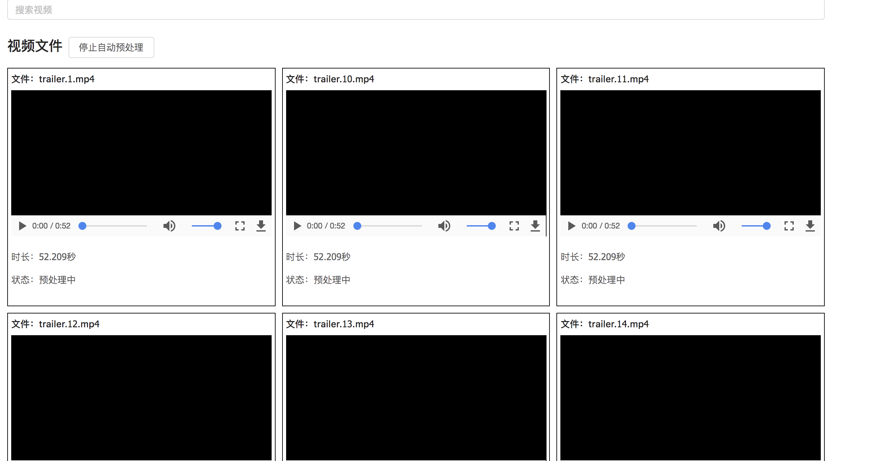
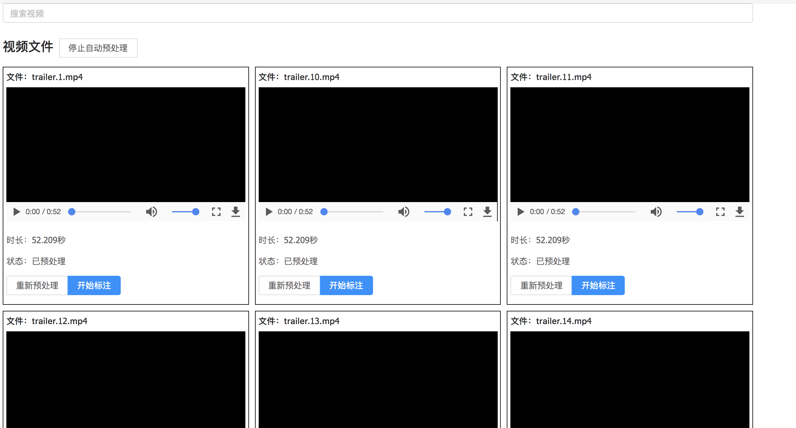
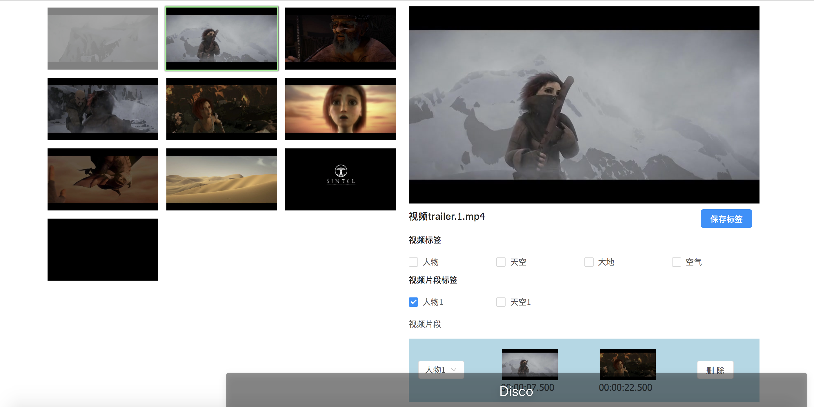

# vott

## 快速入门

### 依赖

Node

ffmpeg

### 获取代码

    git clone git@github.com:JacobChang/vott.git

    cd vott

### 配置

创建配置文件

    cp ./config.json.sample ./config.json

根据个人需要修改配置文件，配置文件各项含义如下

    {
      "videoDir": "./video",     // 视频文件所在目录,
      "outputDir": "./output",   // 视频文件截帧图片以及打标结果存储目录(在jsonlist下)
      "spf": {
        "0~10": "1",             // 0~10分钟视频每1秒截取一帧
        "10~60": "5",            // 10~60分钟视频每5秒截取一帧
        "60": "10",              // 60分钟以上视频每10秒截取一帧
      },
      "labels": {
        "video": [               // 视频标签
          {
            "name": '视频标签1'
          }
        ],
        "clip": [                // 视频片段标签
          {
            "name": "视频片段标签1"
          }
        ]
      }
    }

### 运行

    npm install

    npm run dev

### 使用

1 打开浏览器，默认地址是 http://127.0.0.1:7001 ，页面打开后，可查看当前所有
视频文件，系统将自动进行对视频进行预处理，如下图

2 预处理后可以点击开始标注按钮开始

3 标注页面如下图

标注步骤

1 视频标签

  单击视频标签选项，或者使用快捷键1-9选中标签

2 视频片段标签

  单击视频片段标签选项，或者使用快捷键q-o选中标签

3 片段选取

  单击左侧截帧列表，首次选中开始帧，再次点击结束帧，右侧视频片段会添加选中的片段，该片段会处在选中状态

  点击开始帧或者使用快捷键a可微调开始帧

  点击结束帧或者使用快捷键f可微调开始帧

4 保存

  点击“保存标签“按钮，或者使用快捷键s可保存当前打标结果，并自动跳转至下个视频

  标注结果保存在目录ouputDir/jsonlist下，其中outputDir在配置文件中指定
